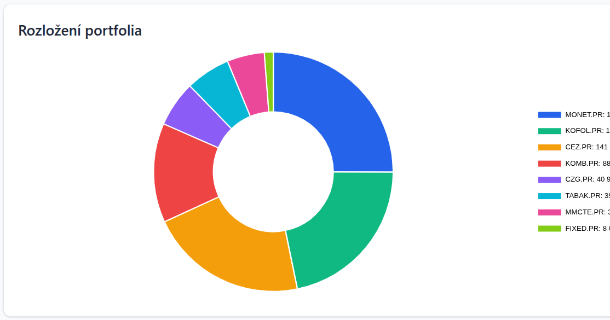

# Prague Stock Exchange Tracker

Webová aplikace pro sledování osobních akcií z Pražské burzy s daňovou optimalizací podle českých zákonů.

## Foto ukázky
  


## Funkce

- **Sledování transakcí**: Přidávání nákupů a prodejů akcií
  - Při prodeji automatický výběr z dostupných akcií v portfoliu
- **FIFO kalkulace**: Automatický výpočet držených akcií pomocí metody FIFO
- **Historie transakcí**: Rozklikávací historie transakcí pro každou akcii v portfoliu
- **Daňová optimalizace**:
  - Zobrazení zbývající daňově osvobozené kapacita (100 000 Kč ročně)
  - Zvýraznění akcií držených déle než 3 roky (vždy daňově osvobozené)
- **Aktuální ceny**: Načítání aktuálních cen z Yahoo Finance
- **Vizualizace zisků/ztrát**: 
  - Přehled zisků a ztrát pro každou akcii v portfoliu
  - Přehled zisků/ztrát podle kalendářního roku pro prodané akcie

## Požadavky

- **Python 3.8 nebo novější** (doporučeno Python 3.9+)

## Instalace

1. Klonujte nebo stáhněte tento repozitář

2. Vytvořte virtuální prostředí:
```bash
python3 -m venv venv
source venv/bin/activate  # Na Linuxu/Mac
# nebo
venv\Scripts\activate  # Na Windows
```

3. Nainstalujte závislosti:
```bash
pip install -r requirements.txt
```

## Spuštění

### Vývojové prostředí

1. Aktivujte virtuální prostředí (pokud ještě není aktivní)

2. Spusťte Flask aplikaci:
```bash
python app.py
```

3. Otevřete prohlížeč na adrese: `http://localhost:5000`

**Poznámka:** Flask zobrazí varování o vývojovém serveru. To je normální pro vývoj. Pro produkční nasazení použijte produkční WSGI server (viz níže).

### Produkční nasazení (trvalé spuštění)

**Příklad produkčních konfiguračních souborů (systemd + gunicorn + Apache2 reverse proxy) najdete ve složce `deploy/`.**

## Použití

### Přidání transakce

1. Vyplňte formulář:
   - Typ transakce (Nákup/Prodej)
     - Při výběru "Prodej" se zobrazí výběr dostupných akcií z portfolia
   - Název akcie (pro nákup zadejte ručně, pro prodej vyberte z rozbalovacího seznamu)
   - Datum transakce (kalendář začíná pondělím)
   - Cena v CZK
   - Množství

2. Klikněte na "Přidat transakci"

### Zobrazení historie transakcí

- Klikněte na název akcie v tabulce Portfolio pro zobrazení historie všech transakcí pro danou akcii
- Historie se zobrazí jako rozbalovací sekce pod řádkem akcie

### Aktualizace cen

1. Klikněte na tlačítko "Aktualizovat ceny"
2. Aplikace načte aktuální ceny ze Yahoo Finance pro všechny akcie v portfoliu

### Daňové informace

Aplikace automaticky zobrazuje:
- Celkové prodeje v aktuálním daňovém roce
- Zbývající daňově osvobozenou kapacitu (100 000 Kč - prodeje)
- Hodnotu akcií držených déle než 3 roky

Akcie držené déle než 3 roky jsou zvýrazněny zelenou barvou v tabulce portfolia.

## Databáze

Aplikace používá SQLite databázi uloženou v `instance/portfolio.db`. Databáze se vytvoří automaticky při prvním spuštění.

## Struktura projektu

```
akcie/
├── app.py                 # Hlavní Flask aplikace
├── models.py              # Databázové modely
├── tax_calculator.py      # FIFO a daňové kalkulace
├── yahoo_finance.py       # Načítání cen z Yahoo Finance
├── config.py              # Konfigurace
├── requirements.txt       # Python závislosti
├── static/
│   ├── css/
│   │   └── style.css      # Styly
│   └── js/
│       └── main.js        # JavaScript
├── templates/
│   ├── base.html          # Základní šablona
│   └── index.html         # Hlavní dashboard
└── instance/
    └── portfolio.db       # SQLite databáze
```

## České daňové zákony

Aplikace implementuje následující pravidla:

- **3leté osvobození**: Akcie koupené před více než 3 lety jsou vždy daňově osvobozené (bez ohledu na částku)
- **100k Kč osvobození**: Celkové prodeje v daňovém roce ≤ 100 000 Kč jsou daňově osvobozené
- **Nezávislá osvobození**: Tyto dvě osvobození jsou nezávislá - prodeje akcií držených >3 roky se NEpočítají do limitu 100 000 Kč
- **FIFO metoda**: Nejstarší nákupy jsou považovány za prodané jako první
- **Daňový rok**: 1. leden až 31. prosinec

## Poznámky

- Yahoo Finance API může mít omezení rychlosti. Při častém aktualizování cen může dojít k dočasným chybám.
- Ceny jsou ukládány do cache v databázi pro rychlejší načítání.
- Pokud není cena dostupná, zobrazí se jako "Nedostupné".

## Licence

Tento projekt je licencován pod [MIT License](LICENSE).

Copyright (c) 2026 @Rohlik

MIT License umožňuje volné použití, úpravy a distribuci za podmínky, že bude zachován copyright notice a text licence.

